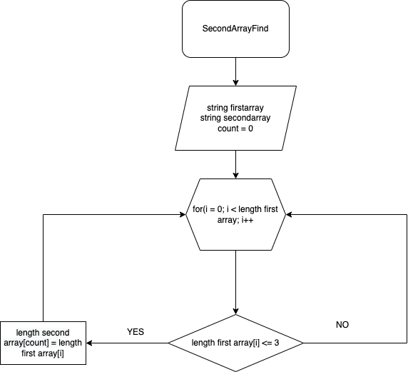

# Описание программы для решения, поставленной задачи

## 1. Задаем первый массив и задаем длину второго массива как у первого
Для этого используем значение ``string``
## 2. Создаем метод для поиска второго массива
Для этого используем цикл ``for``
В цикле через оператор ``if`` находим все строки из первого массива, которые меньше либо равны трем символам и заносим их во второй массив
## 3. Создаем метод для печати, получившегося массива

## 4. Вызываем метод для поиска второго массива, затем вызываем метод для печати, получившегося массива

_``"Прилагаю Блоксхему основной содержательной части (Метода)"``_
